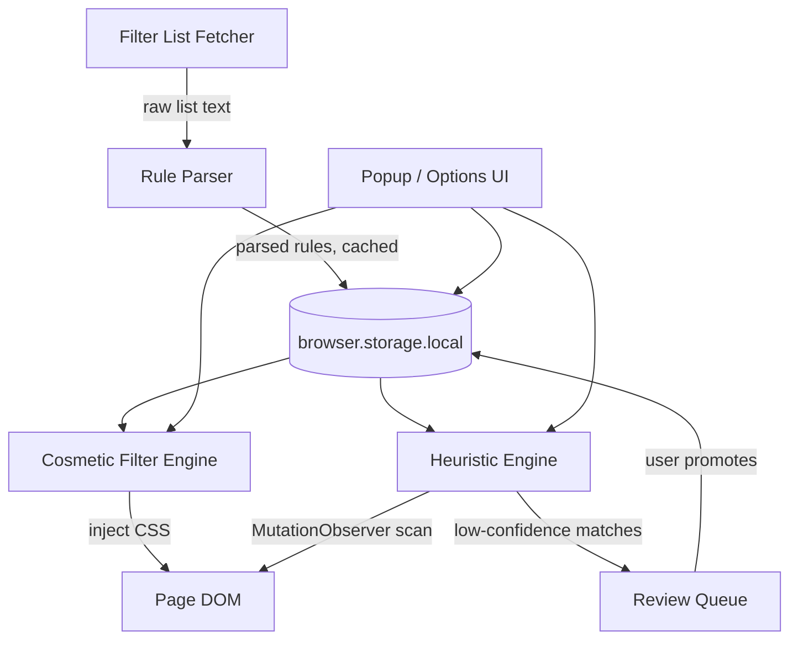

# Architecture

## Overview

Three independent engines, coordinated by a thin control layer. This split
deliberately mirrors uBlock Origin's separation of network filtering from
cosmetic filtering — each engine can be built, tested, and reasoned about
on its own.



## Component breakdown

### 1. List engine (background script)

- Fetches Stevo's `GenAI-Blocklist.txt` and laylavish's list from their raw
  GitHub URLs on a `browser.alarms` schedule.
- Parses each into the rule subset described below, tagged with their
  source list (needed for the dedupe/conflict logic in Phase 2 and for
  preserving attribution).
- Writes parsed rules to `browser.storage.local` under a versioned key so
  schema changes don't require a manual migration script.
- Ships a bundled snapshot of both lists in the extension package itself,
  used until the first successful fetch completes and as a fallback if
  fetches start failing.

### 2. Cosmetic filter engine (content script)

- Receives the current page's hostname-relevant rule subset from the
  background script (don't ship every rule to every page — survey-then-
  inject, same reasoning uBlock uses: smaller per-page CSS, faster apply).
- Injects a `<style>` element at `document_start` for rules that match
  before mutation observation is even possible, to minimize
  flash-of-AI-content.
- Re-evaluates on DOM mutation for elements that get inserted after
  initial load (most AI panels are inserted by client-side JS after the
  initial HTML, not present in the original document).

### 3. Heuristic engine (content script, Phase 3+)

- Runs only on pages that didn't get a full list match, to avoid double
  work.
- Implementation note: keep each scoring signal as an independently testable pure function
  (`scoreTextPattern(el)`, `scoreIconMatch(el)`, `scoreClassNameMatch(el)`,
  `scoreLateInjection(el, observedAt)`) that the combiner sums/weights —
  this makes it possible to unit-test each heuristic against a fixture
  page without running the whole pipeline.

### 4. Control layer (popup + options page + background message handling)

- Master toggle: writes a single boolean to storage; every engine checks
  it before doing anything (cheapest possible "off" — no rules applied,
  no observers running, when off).
- Per-site toggle: hostname-keyed override on top of the master toggle.
- Category toggles (search summaries / chat assistants / autotags /
  writing assistants): rules and heuristics are tagged with a category at
  parse time so this can filter at apply-time without re-parsing.

## Storage schema (`browser.storage.local`)

```ts
{
  "settings": {
    "masterEnabled": boolean,
    "perSiteOverrides": { [hostname: string]: boolean },
    "categoryEnabled": {
      "searchSummaries": boolean,
      "chatAssistants": boolean,
      "autotags": boolean,
      "writingAssistants": boolean
    },
    "aggressiveMode": boolean // Phase 5, default false
  },
  "lists": {
    "[listId]": {
      "sourceUrl": string,
      "license": string,
      "lastFetched": number, // epoch ms
      "etag": string | null,
      "ruleCount": number
    }
  },
  "rules": {
    // parsed, indexed by hostname for fast per-page lookup;
    // generic (non-domain-scoped) rules indexed separately
    "byHostname": { [hostname: string]: Rule[] },
    "generic": Rule[]
  },
  "myRules": Rule[],          // user-promoted local rules, Phase 4
  "reviewQueue": FlaggedMatch[] // low-confidence heuristic hits, Phase 3
}
```

```ts
interface Rule {
  selector: string;
  hostname: string | null;   // null = generic/applies everywhere
  isException: boolean;      // #@# rules
  category: Category;
  sourceListId: string;
}
```

## Filter syntax subset (Phase 1 scope)

Deliberately small. Grow only when a real list rule needs it — check what
Stevo's/laylavish's lists actually use before adding support for anything
not yet needed.

| Syntax | Meaning | In scope Phase 1? |
|---|---|---|
| `##selector` | Hide `selector` on all sites | Yes |
| `example.com##selector` | Hide `selector` only on `example.com` (and subdomains) | Yes |
| `#@#selector` | Exception — un-hide a generic match on this site | Yes |
| `:style(...)` | Apply arbitrary CSS instead of `display:none` | Phase 2 |
| `:has-text(...)`, `:has(...)` procedural operators | Text/structural matching CSS can't express | Phase 2 |
| `##+js(scriptlet, args)` scriptlets | JS-based hiding for cases CSS can't reach | Phase 2, allowlisted scriptlets only — see `CLAUDE.md` constraint 3 |
| Network filter syntax (`||domain^`) | Request blocking | Phase 5, separate engine entirely |

## Why cosmetic filtering is the primary mechanism here (not network blocking)

Most AI UI is first-party: injected by the host site's own JavaScript, not
a separate blockable network request. This is the key way this project
differs from a tracker/ad blocker, where the third-party request itself is
usually the thing to block. Network-layer suppression (Phase 5) is real but
secondary, and only applies where an AI feature happens to also be a
genuinely separate backend call.

## Performance notes

- Per-page rule lookup must be O(rules relevant to this hostname), not
  O(all rules in all subscribed lists) — index by hostname at parse time,
  not at apply time.
- `MutationObserver` callbacks (heuristic engine) should batch and debounce
  — don't run the full scoring pipeline synchronously on every single
  mutation record on a chatty page.
- Master-off must be a true no-op: no listeners registered, no observers
  running, not just "rules present but suppressed." Check the toggle before
  doing any setup work, not after.

## Privacy/security posture

- No analytics, no remote code execution beyond CSS + the fixed, named
  scriptlet allowlist (see `CLAUDE.md`).
- The only outbound network requests this extension makes on its own are
  the periodic filter-list fetches, to fixed, hardcoded URLs.
- Heuristic-engine matches never leave the device unless the user
  explicitly clicks "report."
