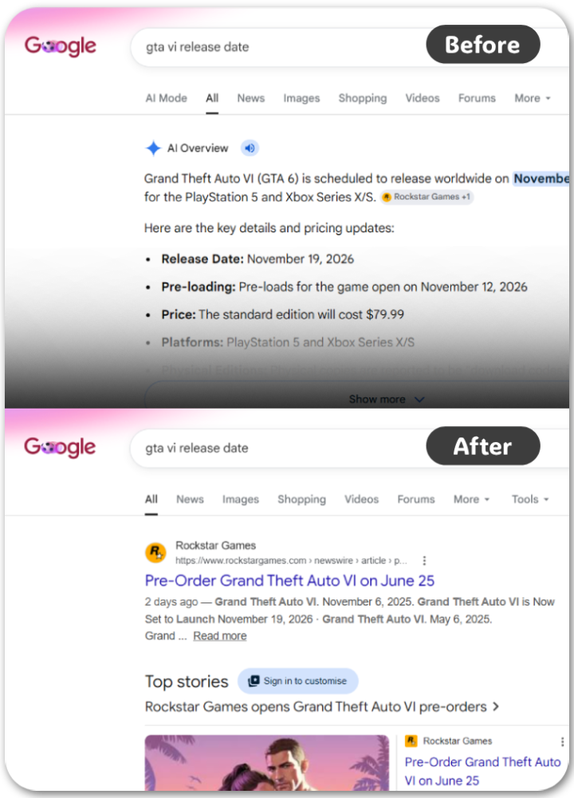
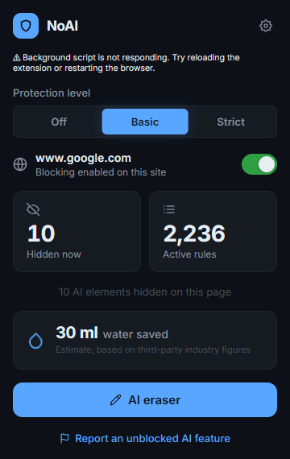

<div align="center">


# NoAI - Claim back the Web

**You didn't ask for AI on every website. Now it is gone.**

[](#)
[](#)
[](#)
[](https://opensource.org/licenses/MIT)
[](https://github.com/diluteoxygen/noai/stargazers)
[](https://github.com/diluteoxygen/noai/issues)
[](https://github.com/sponsors/diluteoxygen)

</div>

## Installation

| Browser | Install from... | Status |
| :---: | :--- | :--- |
|  | **Chrome Web Store** | ✨ **Coming soon!** We'd love to bring NoAI to Chrome, but Google requires a small $5 developer fee. If you'd like to help us get there, please consider [**supporting the project**](https://github.com/sponsors/diluteoxygen)! ☕ |
|  | **[Firefox Add-ons](https://addons.mozilla.org/en-US/firefox/addon/noai-remove-ai-clutter/)** | ⏳ **Under Review!** Mozilla is currently checking our submission. It should be live and ready to install very soon! |
|  | **[GitHub Releases](https://github.com/diluteoxygen/noai/releases)** | 📦 **Available Now!** Download the latest `.zip` here and load it manually into your browser. |

Install the extension. It works immediately. No configuration required.

### Manual Installation (Unpacked)

If you downloaded the `.zip` from GitHub Releases, you must load it manually. 

**Chrome / Edge / Brave**
1. Unzip the downloaded file.
2. Go to `chrome://extensions` (or `edge://extensions`).
3. Turn on **Developer mode** (top right).
4. Click **Load unpacked** and select the unzipped folder.

**Firefox**
1. Unzip the downloaded file.
2. Go to `about:debugging#/runtime/this-firefox`.
3. Click **Load Temporary Add-on**.
4. Select `manifest.json` inside the folder. 

*(Note: Firefox uninstalls manual add-ons when you restart. For a permanent install, use the official Mozilla store link above.)*

## The problem

Google Search, Gmail, YouTube, GitHub, Bing, Amazon, and Reddit inject AI UI by default. They graft overviews, summarizers, and chat widgets onto products you already use. There is no browser-level switch to turn them off. Finding per-site settings is tedious. (If the settings exist at all.)

This project turns manual configuration into a single master switch. It blocks the UI elements. It drops the network requests to AI endpoints. The internet, minus the slop.

## What it blocks

<table>
  <tr>
    <td width="50%" valign="top">
      
    </td>
    <td width="50%" valign="top">
      The standard blocklist removes AI features from daily tools. Examples include:
      <br><br>
      <ul>
        <li><b>Google</b>: AI Overviews in search results.</li>
        <li><b>YouTube</b>: Ask buttons, video summaries, auto-dubbing, and Super Resolution upscaling.</li>
        <li><b>Microsoft</b>: Copilot buttons across GitHub, Bing, Microsoft 365, and the Azure Portal.</li>
        <li><b>Amazon</b>: Rufus product and review summaries.</li>
        <li><b>Reddit</b>: AI Answers and recommended posts from AI subreddits.</li>
        <li><b>Social Media</b>: Facebook's AI chat, X's Grok buttons, and TikTok videos tagged as AI-generated.</li>
        <li><b>Art Platforms</b>: Images on Pixiv and DeviantArt with AI-generated labels.</li>
      </ul>
    </td>
  </tr>
</table>

## Optional blocklists



If the standard blocking isn't enough, you can enable additional filters in the settings:

- **AI Chatbots**: Blocks standalone tools like ChatGPT, Claude, and Gemini outright. Turn this on if you want to break the habit of using them.
- **AI Slop**: Hides low-effort, AI-generated content farms and spam domains from your search results.
- **Generative AI Extra**: Aggressive UI filtering. Catches edge cases, but carries a higher risk of breaking page layouts.

<br clear="right"/>

## Architecture

This is a Universal Manifest V3 codebase. The exact same source code compiles natively for Google Chrome and Mozilla Firefox. It handles the differences between Chrome's Service Worker constraints and Firefox's Event Pages automatically.

It uses Declarative Net Request (DNR) for aggressive network-level blocking of known AI endpoint domains. For the UI, it relies on cosmetic CSS filters. It injects these filters as user-origin stylesheets. (User-origin CSS natively pierces both open and closed Shadow DOMs at the browser engine level, and overrides site `!important` tags without DOM traversal overhead.)

The simplest engine that holds the line.

## Prior art

This extension is a specialized engine for existing lists. It wraps open work. Upstream your generic filter fixes to the original maintainers:

- [Stevo's AI Blocklist](https://github.com/Stevoisiak/Stevos-AI-Blocklist)
- [laylavish's Huge AI Blocklist](https://github.com/laylavish/uBlockOrigin-HUGE-AI-Blocklist)
- [Fanboy's Anti-AI Suggestion List](https://github.com/easylist/easylist/blob/master/fanboy-addon/fanboy_ai_suggestions.txt)
- [uBlock Origin](https://github.com/gorhill/uBlock)

They found the nodes. We just hide them.

## FAQ

**Does this break websites?**  
Rarely. The cosmetic filters hide UI nodes without interfering with the underlying page logic. If a layout breaks, toggle the extension off for that specific domain.

**Can I whitelist a site?**  
Yes. Open the extension popup to disable blocking on a per-site basis.

**Why not just use uBlock Origin?**  
You can. NoAI uses the same lists. We built NoAI as a dedicated switch for users who don't want to manage custom filter subscriptions and manual updates.

## Local dev

Install the dependencies. Build the extension into a loadable format. 

```bash
npm install
npm run build
```


The shortest path to a running extension.

## Docs

Looking to audit the code or publish an update? 
- [Contributing](CONTRIBUTING.md) — local setup.
- [Publishing](PUBLISHING.md) — store releases.
- [Security](SECURITY.md) — vulnerability reporting.

Read them if you need them. Don't if you don't.

## License

MIT. The shortest license that works.
